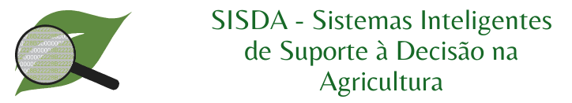

# FA084 - Introdução à Mineração de Dados na Agricultura

**Professor:** Luiz Henrique Antunes Rodrigues

**PED:** Matheus Agostini Ferraciolli

Este repositório contém os códigos e links para os dados das aulas práticas.


### R para Windows: [Link R](https://cran.r-project.org/bin/windows/base/)

### Rstudio para Windows: [Link RStudio](https://download1.rstudio.org/)

**Se alguém quiser instalar no Linux e não conseguir, me mande um email: matheus.ferraciolli@feagri.unicamp.br**


<!---
### Instalação e execução do `swirl`
Para instalar o pacote `swirl`, basta executar o comando abaixo. Este comando instala o pacote na sua máquina. As aspas são obrigatórias. Uma vez instalado, não precisa executar de novo.

```{r}
install.packages('swirl')
```

Para carregar o pacote, use `library(swirl)` ou `library('swirl')`. Este comando ativa o pacote na sessão aberta do R e deve ser executado sempre que se reinicia o programa. As aspas são opcionais.

Para começar o tutorial, após executar o comando acima, digite:

```{r}
swirl()
```

Em seguida, siga o tutorial que vai começar na tela. Coloque um nome que lembre para continuar de onde parou e manter o progresso de cada sessão. Recomendamos fazer as sessões de **1 a 4** para a aula do 28/03. --->
